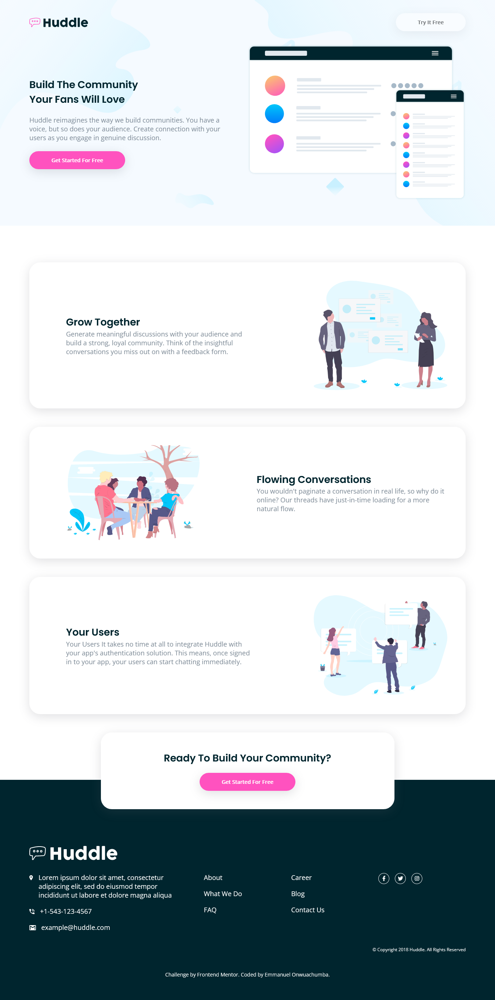

# Frontend Mentor - Huddle landing page with alternating feature blocks solution

This is a solution to the [Huddle landing page with alternating feature blocks challenge on Frontend Mentor](https://www.frontendmentor.io/challenges/huddle-landing-page-with-alternating-feature-blocks-5ca5f5981e82137ec91a5100). Frontend Mentor challenges help you improve your coding skills by building realistic projects.

## Table of contents

- [Overview](#overview)
  - [The challenge](#the-challenge)
  - [Screenshot](#screenshots)
  - [Links](#links)
- [My process](#my-process)
  - [Built with](#built-with)
  - [What I learned](#what-i-learned)
  - [Continued development](#continued-development)
- [Author](#author)

**Note: Delete this note and update the table of contents based on what sections you keep.**

## Overview

### The challenge

Users should be able to:

- View the optimal layout for the site depending on their device's screen size
- See hover states for all interactive elements on the page

### Screenshots

### Links

- Solution URL: [Solution URL](https://www.frontendmentor.io/solutions/huddle-landing-page-with-alternating-feature-blocks-E6uwRMFOqB)
- Live Site URL: [Live Site](https://frontend-mentor-huddle-challenge.netlify.app/)

## My process

### Built with

- Semantic HTML5 markup
- CSS custom properties
- CSS Flexbox

### What I learned

This is my very first project on Frontend Mentor. I learned how to use different flexbox properties to align items along both the main and the cross axis. I also learnt firsthand how Responsive Web Design works.

### Continued development

I plan to build more Frontend Mentor projects to help me sharpen my HTML & CSS skills, and when I am confident, I will move over to projects that include JavaScript.

## Author

- Website - [Emmanuel Onwuachumba](https://github.com/devmanuel1)
- Frontend Mentor - [@devmanuel1](https://www.frontendmentor.io/profile/devmanuel1)
- Twitter - [@devmanuel\_](https://www.twitter.com/devmanuel_)
